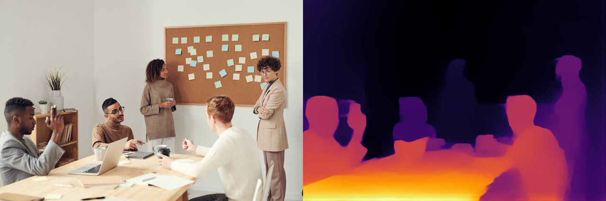

# MiDas Converter
Utility to convert RGB frames into depth frames by using MiDas.



*Office demo image by [fauxels](https://www.pexels.com/@fauxels) from Pexels*

### Installation
It is recommended to use a seperate Python envrionment ([virtualenv](https://virtualenv.pypa.io/en/latest/)) and Python 3.6.7 (Windows 10) or Python 3.8.5 (MacOS).

1. Download and install the latest [OpenVINO framework](https://software.intel.com/content/www/us/en/develop/tools/openvino-toolkit.html) (`2021.1`).
2. Run the following script to install the models, convert them and setup the environment:

```bash
# one-script setup of the full environment (grab a coffee ☕)

# windows
setup.bat

# unix
./setup.sh
```

### Demo

Either use a predefined batch script to run the examples or call the demo itself.

```bash
# demo
run.bat
./run.sh

# on your own image
python monodepth_demo.py -m public\midasnet\FP32\midasnet.xml -i yourimage.jpg
```

There is also a live webcam-feed inference example.

```bash
run_webcam.bat
./run_webcam.sh
```

#### Batch Convert

To batch convert a lot of frames run the `monodepth_convert.py` script.

```bash
python monodepth_convert.py -m public\midasnet\FP32\midasnet.xml -i frames
```

### About

The [MiDas network](https://github.com/intel-isl/MiDaS) and the pre-trained weights are part of the [Intel ISL](https://github.com/intel-isl). This repository just adds some scripts and utilties to work with it.
